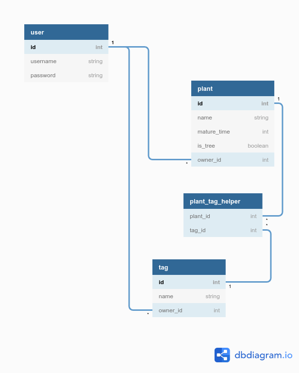

# Odd Realm Botany Index
 --- 
Feedback may be given in both finnish and english
 --- 

This project will deal with categorising grow times, biome occurrences, etc. of various crops (and trees) in the colony-building game Odd Realm. 
 
In the game, plants and trees can be sown and cultivated from seed and may also grow naturally depending on season and chosen biome. Some tree varieties may also yield fruit.
 
Tracking fruit<->tree relations specifically is not planned, as such occurrences are few and fairly obvious (apples from apple trees, coconuts from palm trees); similar functionality can be achieved with matching tags.
  
Current planned features<ul>
  <li>login with username+password for item tracking and/or admin functionality</li>
  <li>adding/editing/removing entries for plants and tags (admin-only?)</li>
  <li>searching for botanical items based on attributes (grow time/season/biome/other tags?)</li>
</ul>
 
The planned database's relationship diagram:
 

